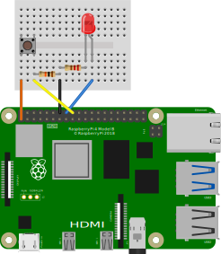

# RPI 4 Computer Vision Setup

These are the steps I've been using recently to build a command-line only [Raspberry PI](https://www.raspberrypi.org) 4 image with [openFrameworks](https://openframeworks.cc) 11.2 and [OpenCv](https://opencv.org) 4.5.x. This has been tested with the [Pi 4b](https://www.raspberrypi.org/products/raspberry-pi-4-model-b/), [Pi 400](https://www.raspberrypi.org/products/raspberry-pi-400/), and [Compute Module 4](https://www.raspberrypi.org/products/compute-module-4/?variant=raspberry-pi-cm4001000).

Note: that we will be using raw OpenCV calls, and not depending on the openFrameworks libraries that are out of date and not well maintained. Plus, we want to use "as-is" the latest OpenCv C++ examples found online and in computer vision forums, courses, books, and training guides.

## Context
These instructions were created for my own personal needs, but also for the atelier I run at the [Aix-en-Provence School of Art](https://esaaix.fr/) and the [Master Media Design](https://www.hesge.ch/head/formations-recherche/master-en-media-design) of the [HEAD – Genève](https://www.hesge.ch/head/) where we often need computer vision detection within our projects.

## Machine Learning and C++
You will find a lot of the latest neural network fancy fancy is mostly written in Python; but more and more is available in C++, especially for people working with smaller "on the edge" machine learning (i.e. this Raspberry Pi type configuration). OpenCV does not have all the latest Deep Learning integrated, but it has a lot that you can work with and has integrated more and more neural network code over the past few years. If you are interrested in this aspect, a good starting poing is here: [github.com/spmallick/learnopencv](https://github.com/spmallick/learnopencv). There you will find various articles on integrating old-skool computer vision with newer neural networks flavors; for example, this article shows how to import models from TensorFlow or Darknet into the C++ OpenCV DNN module: [Deep Learning with OpenCV's DNN Module](https://learnopencv.com/deep-learning-with-opencvs-dnn-module-a-definitive-guide/).

## Raspberry OS 64
Note: I have yet to figure out how to install openFrameworks on Raspberry OS 64. According to Q-Engineering, you can get significant speed increases with 64-bit Raspberry OS, so I will have to figure this out at some time. Cf. [Install OpenCV 4.5 on Raspberry 64 OS](https://qengineering.eu/install-opencv-4.5-on-raspberry-64-os.html)

## Raspberry Pi 4
Using OpenCv requires a decent amount of RAM, but I have not been able to fully take advantage of all 8GB of the RPI4, despite numerous attemps. Most of my uses — for example processing full 1280 x 720 HDMI video feeds — seem to work fine with a 4GB Raspberry. I have not tested with 2GB Raspberry 4.

- [Raspberry Pi 4 Model B](https://www.raspberrypi.org/products/raspberry-pi-4-model-b/)
- [Kubii](https://www.kubii.fr) (France for me), see Raspberry website for local distributors of each product
- [Raspberry Pi 400](https://www.kubii.fr/raspberry-pi-400/3084-kits-raspberry-pi-400-3272496302914.html)
- [Raspberry Pi 4 Modèle B](https://www.kubii.fr/174-raspberry-pi-4-modele-b)
- [Compute Module 4](https://www.raspberrypi.org/products/compute-module-4/?variant=raspberry-pi-cm4001000)
  - [Compute Module IO Board](https://www.raspberrypi.org/products/compute-module-4/?variant=raspberry-pi-cm4001000)
  - [How to Make a Raspberry Pi Compute Module 4 Carrier Board in KiCad](https://www.youtube.com/watch?v=ypcPJC_umPQ)

## Capture Device
I have been using the Raspberry Cameras (infrared and standard models) that use the integrated camera interface, as well as the Elgato Camlink 4k USB capture devices for HDMI capture. I have tried many HDMI capture solutions that convert HDMI signals into the standard interface, including the Auvidea B101 and Chinese knockoffs. So far, no sucess at a stable installation with HDMI > CSI.

- [Camera Module v2](https://www.raspberrypi.org/products/camera-module-v2/)
- [Camera Module v2 Infrared](https://www.kubii.fr/idees-cadeaux/1654-nouvelle-camera-infrarouge-v2-8mp-kubii-640522710898.html) (Kubii)
- [130° Infrared Camera with illumination](https://www.kubii.fr/cameras-accessoires/2333-raspberry-pi-camera-fisheye-grand-angle-5mp-kubii-3272496012561.html)
- [Elgato Camlink 4k](https://www.elgato.com/fr/cam-link-4k)
- HDMI to CSI
  - [HDMI to CSI](https://www.kubii.fr/convertisseurs-adaptateurs-raspberry/3210-adaptateur-hdmi-vers-csi-camera-raspberry-pi-3272496305359.html) (Kubii)
  - [Auvidea B101](https://auvidea.eu/b101-hdmi-to-csi-2-bridge-15-pin-fpc/)
    - Raspberry Forum discussing Auvidea setup: [https://www.raspberrypi.org/forums/viewtopic.php?t=216903#p1437501]()
    - [Raspberry Pi 4: OpenCV with Auvidea B101 HDMI to CSI-2 Bridge on Raspbian 10](https://www.youtube.com/watch?v=2In8TEsvMQM) (this got me close, but remains unstable)

## Screen
Touch screens are handy for installations, or for the final project. There are official screens, and stuff from China that works but with wonky resolution stretching and that cannot always be (easily) configured.

- [Official 7" Screen](https://www.kubii.fr/ecrans-afficheurs/1131-ecran-tactile-officiel-7-800x480-kubii-640522710829.html)
- [3.5" Screen](https://www.amazon.fr/dp/B08HVDLHRW/)
- [7" Screen](https://www.amazon.fr/dp/B085NHF15M)

## SD Card
Start with a blank SD card.

- Tests
  - [Raspberry PI Micro SD Cards](https://www.tomshardware.com/best-picks/raspberry-pi-microsd-cards)
- Current cards I've been using:
  - [SanDisk MAX ENDURANCE microSDHC](https://www.amazon.fr/dp/B084CJ96GT)
  - [SanDisk Ultra MicroSDHC](https://www.amazon.fr/gp/product/B073K14CVB)

## Download Raspberry PI OS Lite
Download either the Raspberry Pi with Desktop, or the Lite. You can directly download and install these images from the official Pi Imager software in the next step.

- [https://www.raspberrypi.org/software/operating-systems/]()
- This how-to uses the following image from 2021-03-04:
  - [https://downloads.raspberrypi.org/raspios_lite_armhf/images/raspios_lite_armhf-2021-03-25/2021-03-04-raspios-buster-armhf-lite.zip]()
  - [https://downloads.raspberrypi.org/raspios_lite_armhf/images/raspios_lite_armhf-2021-03-25/2021-03-04-raspios-buster-armhf-lite.zip.torrent]() (Torrent)

## Install onto SD Card
- [Raspberry Pi Imager](https://www.raspberrypi.org/software/)
- [Balena Etcher](https://www.balena.io/etcher/)

## Turn On
- Install SD Card
- Plug in an HMDI monitor before powering on
- Power using a compatible USB-C adapter. There is a bug with the RPI 4's USB-C power plug design, so be careful to use not just any adapter. There are cheap adapters out there.
- Plug in a USB Keyboard

## Configure PI
On first boot, the PI should resize the volume to match the card size

- login: `pi`
- password: `raspberry`

Note: on French keyboards `q` and `a` keys will be inverted. We'll fix keyboard configuration in next steps
  
Tip: if you can't see your command line because of overscan, once you are logged in type `clear` and `{enter}` a few times. We'll fix over/underscan in next steps.

### raspi-config
When you get to the command line, open `sudo raspi-config` to start configuring your installation

### Keyboard
In this order of frequency, I use: French, Swiss French, American, Korean, Chinese, Japanese, Swiss German, and a whole bunch of other keyboards (my students are from everywhere). Here is how I set up my French keyboards:

- `5` Localisation Options > `L3` Keyboard > `Generic 105-Key` (or whatever) > `other` > `French` > Keyboard layout `French` > `default` > `no compose key`

### Wifi
- `1` System > `S1` Wireless LAN > configure your wifi

### Password
- `1` System > `S3` Password > enter a unique password

### Autologin
- `1` System > `S5` Boot/Auto-login > `B2` Console Autologin (or `B1` if you want to stay safe)

### Camera
- `3` Interface > `P1` Camera > `YES`

### SSH
- `3` Interface > `P2` SSH > `YES` (make sure you set a good password in the previous steps)

### SPI
- `3` Interface > `P4` SPI > `YES` (if you do electronic interfacing stuff over SPI)

### I2C
- `3` Interface > `P5` SPI > `YES` (if you do electronic interfacing stuff over I2C)

### KMS Graphics Driver
- `6` Advanced Options > `A2` GL Driver > `KMS Driver enabled`

### Display
- `2` Display Options > `D2` Underscan > `YES/NO` (depending on your monitor's handling of the HDMI signal)

`Finish` to exit this menu to the command line

### Overscan Problems
If you're still having problems with overscan, from the command line, open the editor of the configuration file :
`sudo nano /boot/config.txt`. Remove `#` symbols to make sure `#disable_overscan=0` (yes, this is the de-activation of a negative, yes all this is impossibly inelegant) and un-comment to change values of `overscan_left=40`, etc. I have sometimes used negative values in the past. More recent monitors do not usually need overscan and so you can `disable_overscan=1`.

Quit the `nano` text editor by typing the `{ctrl}` + `x` keys > `y` + `{enter}`. And then reboot from the command line with `sudo reboot now`. You might need to `clear` and `{enter}` to see your command prompt.

## Bluetooth Keyboard
I like using the Logitech K380 keyboards because they allow easy switching between various devices: Pi, Mac, Windows, iPadOS, etc. They come in pink, as well as other, less important, colors. They (finally) have all the colors in the French keyboard layout: [Logitech K380 Multi-Device Keyboard](https://www.logitech.com/fr-ch/product/multi-device-keyboard-k380?crid=27). These are very handy in complex art and design installations I do that often make it difficult to access the ports. 

To pair a bluetooth keyboard, you need put your keyboard into pairing mode, then to go into `bluetoothctl`, `scan` the bluetooth controller for available bluetooth devices identifiers, find your device, turn off scan, and then `pair`, `trust`, and `connect` your device.

During the Logitech keyboard `pair` process you need to enter a `######` + `{enter}` keyboard combination that is random each time. Follow the instructions from the command line.

```
sudo bluetoothctl
[bluetooth]# power on
[bluetooth]# agent on
[bluetooth]# default-agent
[bluetooth]# scan on
[bluetooth]# scan off
[bluetooth]# pair XX:XX:XX:XX:XX
[bluetooth]# trust XX:XX:XX:XX:XX
[bluetooth]# connect XX:XX:XX:XX:XX
[bluetooth]# exit
```

## Connect Via SSH
To control your Raspberry from your Mac, Windows or Linux computer, find your Raspberry's IP address by typing `ifconfig` on the command line of the Raspberry Pi. You'll find your Ethernet, localhost, and Wifi addresses listed (for example) as `inet 192.168.#.###` with actual numbers instead of `###`.

For example, on a Mac, open the **Terminal** (`{command}` + `{space}` + `Terminal`) and connect via SSH:

```
ssh pi@192.168.#.###
```

Enter the `password` of the Raspberry Pi and you are now controlling the PI from the Terminal of your personal computer. This is easier for some commands, for example the long list of `CMAKE` commands below.

If you have an error similar to `WARNING: REMOTE HOST IDENTIFICATION HAS CHANGED!` you might need to remove your IP address from the "known hosts" file. To remove my "known hosts" file I remove the line containing the offending IP address from VS Code on my Mac:

```
code /Users/abstractmachine/.ssh/known_hosts
```

### SSH Extension in VS Code
An even more elegant solution for coding your Raspberry from the comfort of another computer/laptop is the [SSH Extension in VS Code](https://marketplace.visualstudio.com/items?itemName=ms-vscode-remote.remote-ssh). To install, just follow that link and it will open the extension in your VS Code browser.

Once you are connected via this extension, you can open the internal terminal view (`View` > `Terminal`) and control your Raspberry directly from within VS Code.

## Update
```
sudo apt-get update
sudo apt-get upgrade
```

## Install OpenCV
This suite of commands is entirely based on the Q-Engineering OpenCV Installation guides: [Install OpenCV 4.5 on Raspberry PI 4](https://qengineering.eu/install-opencv-4.5-on-raspberry-pi-4.html). These guides are amazingly detailed with information that I will not reproduce here.

### Check eprom update
```
# to get the current status
$ sudo rpi-eeprom-update
# if needed, to update the firmware
$ sudo rpi-eeprom-update -a
$ sudo reboot
```

### Dependencies
Many of following installations are also installed [via openFrameworks](https://github.com/openframeworks/openFrameworks/blob/master/scripts/linux/debian/install_dependencies.sh), but since there is not a 100% overlap, I do all these first.

There are a lot of of `Y`es prompts, so you have to watch the output.

```
$ sudo apt-get install cmake gfortran
$ sudo apt-get install libjpeg-dev libtiff-dev libgif-dev
$ sudo apt-get install libavcodec-dev libavformat-dev libswscale-dev
$ sudo apt-get install libgtk2.0-dev libcanberra-gtk*
$ sudo apt-get install libgstreamer1.0-dev libgstreamer-plugins-base1.0-dev
$ sudo apt-get install libxvidcore-dev libx264-dev libgtk-3-dev
$ sudo apt-get install libtbb2 libtbb-dev libdc1394-22-dev libv4l-dev
$ sudo apt-get install libopenblas-dev libatlas-base-dev libblas-dev
$ sudo apt-get install libjasper-dev liblapack-dev libhdf5-dev
$ sudo apt-get install protobuf-compiler
```

### Raspberry Lite Requirements
```
$ sudo apt-get install python3-dev python3-numpy python3-pip
$ sudo apt-get install python-dev python-numpy
```

### OpenCV
I am currently using `4.5.2`. Check for latest releases on [github.com/opencv](https://github.com/opencv).

Note: `-O` is the letter `O` for [`--output-document`](https://www.gnu.org/software/wget/manual/wget.html#Download-Options) and not the number zero.

```
$ cd ~
$ wget -O opencv.zip https://github.com/opencv/opencv/archive/4.5.2.zip
$ wget -O opencv_contrib.zip https://github.com/opencv/opencv_contrib/archive/4.5.2.zip

$ unzip opencv.zip
$ unzip opencv_contrib.zip

$ rm opencv.zip
$ rm opencv_contrib.zip

$ mv opencv-4.5.2 opencv
$ mv opencv_contrib-4.5.2 opencv_contrib
```

### Python
Since we're on a Raspberry that will probably be single-use, I'm not installing a virtual environment. This is a bad idea on a personal computer that you use for multiple projects.

We need to install `pip`, because it isn't installed on "Lite" versions of Raspberry OS.

```
$ sudo apt-get install python-pip
$ pip install numpy
$ export PATH=/home/pi/.local/bin:$PATH
```

### Make

```
$ cd ~/opencv/
$ mkdir build
$ cd build
```

```
$ cmake -D CMAKE_BUILD_TYPE=RELEASE \
-D CMAKE_INSTALL_PREFIX=/usr/local \
-D OPENCV_EXTRA_MODULES_PATH=~/opencv_contrib/modules \
-D ENABLE_NEON=ON \
-D ENABLE_VFPV3=ON \
-D WITH_OPENMP=ON \
-D WITH_OPENCL=OFF \
-D BUILD_TIFF=ON \
-D WITH_FFMPEG=ON \
-D WITH_TBB=ON \
-D BUILD_TBB=ON \
-D BUILD_TESTS=OFF \
-D WITH_EIGEN=OFF \
-D WITH_GSTREAMER=ON \
-D WITH_V4L=ON \
-D WITH_LIBV4L=ON \
-D WITH_VTK=OFF \
-D WITH_QT=OFF \
-D OPENCV_ENABLE_NONFREE=ON \
-D INSTALL_C_EXAMPLES=OFF \
-D INSTALL_PYTHON_EXAMPLES=OFF \
-D BUILD_opencv_python3=TRUE \
-D OPENCV_GENERATE_PKGCONFIG=ON \
-D BUILD_EXAMPLES=OFF ..
```

Make sure to include the `..` at the end.

Increase the `swapfile` settings temporarily:

```
sudo nano /etc/dphys-swapfile
```

Change this line
```
#CONF_SWAPSIZE 100
CONF_SWAPSIZE 2048
```

Leave `nano` with `{ctrl}` + `x` > `Y` + `{enter}`.

From the command line, restart the swapfile service thingamajig with this new value:

```
$ sudo /etc/init.d/dphys-swapfile stop
$ sudo /etc/init.d/dphys-swapfile start
```

Now we can finally make our build:

```
$ make -j4
```

And now that we've built it, install it:

```
$ sudo make install
$ sudo ldconfig
# cleaning (frees 300 KB)
$ make clean
$ sudo apt-get update
```

Reset the `swapsize` back to its standard value :
```
$ sudo nano /etc/dphys-swapfile
```

```
CONF_SWAPSIZE 100
#CONF_SWAPSIZE 2048
```

Reboot:
```
$ sudo reboot now
```

### Verify Installation

```
python
```

```
>>> import cv2
>>> cv2.__version__
'4.5.2'
>>> print( cv2.getBuildInformation() )
>>> quit()
```

```
python3
```

```
>>> import cv2
>>> cv2.__version__
'4.5.2'
>>> print( cv2.getBuildInformation() )
>>> quit()
```

## Install openFrameworks 11.2

We are following this guide, with some modifications: [openFrameworks on Raspberry PI: Getting Started](https://openframeworks.cc/setup/raspberrypi/raspberry-pi-getting-started/)

### Download OF 11.2

```
$ cd
$ wget https://openframeworks.cc/versions/v0.11.2/of_v0.11.2_linuxarmv6l_release.tar.gz
$ mkdir openFrameworks
$ tar vxfz of_v0.11.2_linuxarmv6l_release.tar.gz -C openFrameworks --strip-components 1
```

### Install dependencies
```
$ cd /home/pi/openFrameworks/scripts/linux/debian
$ sudo ./install_dependencies.sh
$ sudo ./install_codecs.sh
```

### Compile openFrameworks
```
$ make Release -C /home/pi/openFrameworks/libs/openFrameworksCompiled/project
```

### Install ofxRPI4Window
After compiling openFrameworks, install ofxRPIWindow.

We are using the "lite", command-line only version of Raspberry OS. Currently, if you want to run an openFrameworks designed app from the command line on Raspberry PI 4 without the "windowed" version installed, you need to use ofxRPI4Window as a starting point instead of the standard openFrameworks examples — for example the `empty` example. Currently, this addons does not have any keyboard implementation, which is fine for our uses because we'll be using the `GPIO` pins for input/output, similar to how we would work with an Arduino board.

Cf. [ofxRPI4Window](https://github.com/jvcleave/ofxRPI4Window)

Go into the `addons` folder and clone this addon:

```
$ sudo apt-get install git
$ sudo apt-get install libgbm-dev
$ cd /home/pi/openFrameworks/addons
$ git clone https://github.com/jvcleave/ofxRPI4Window.git
```

Change config.linuxarmv6l.default.mk file:

```
nano /home/pi/openFrameworks/libs/openFrameworksCompiled/project/linuxarmv6l/config.linuxarmv6l.default.mk
```

```
ifeq ($(USE_PI_LEGACY), 1)
	PLATFORM_DEFINES += TARGET_RASPBERRY_PI_LEGACY
    $(info using legacy build)
else
	# comment this for older EGL windowing. Has no effect if USE_PI_LEGACY is enabled
	# GLFW seems to provide a more robust window on newer Raspbian releases
	#USE_GLFW_WINDOW = 1
endif
```

And comment out `ofSetupOpenGL` in the `ofAppRunner.cpp` file on line #31.

```
$ nano /home/pi/openFrameworks/libs/openFrameworks/app/ofAppRunner.cpp
```

Add `/*` ... `*/` around the entire `ofSetupOpenGL()` method

### Compile First App
Copy and compile an ofxRPI4Window example and run it.

```
$ cp -R /home/pi/openFrameworks/addons/ofxRPI4Window/example-billboard /home/pi/openFrameworks/apps/myApps/example-billboard
$ cd /home/pi/openFrameworks/apps/myApps/example-billboard
$ make
$ make run
```

### Add the ofxGPIO addon
```
$ cd /home/pi/openFrameworks/addons
$ git clone https://github.com/kashimAstro/ofxGPIO.git
```

## Create Skeleton
We need an empty "skeleton" project from which to start each project. We are going to start with one of the smaller examples from ofxRPI4Window, which we will copy (and rename) into our `myApps` folder and rewrite as our new "bare bones" skeleton project.

First, remove the current `empty` folder.

```
$ rm -R /home/pi/openFrameworks/apps/myApps/EmptyExample
```

Copy (`cp`) the contents of the example folder. I have called it `EmptyWindow`, but you can call it whatever you want:

```
$ cp -r /home/pi/openFrameworks/addons/ofxRPI4Window/example-3DPrimitives /home/pi/openFrameworks/apps/myApps/EmptyWindow
```


### Rewrite Example
Now we will create a empty skeleton from which we can work. Let's empty out all the current code, and create a simple empty wrapper, waiting for our own code. Start by going into the `src` folder:

```
$ cd /home/pi/openFrameworks/apps/myApps/EmptyWindow/src
```

Edit the `ofApp.h` file and empty out most of its behavior, leaving only the skeleton `setup()`, `update()`, and `draw()` methods.

```
$ nano ofApp.h
```

Here is my current `ofApp.h` skeleton file:

```
#pragma once

#include "ofMain.h"

class ofApp : public ofBaseApp{
	
public:
	void setup();
	void update();
	void draw();
	
};
```

Now edit the `ofApp.cpp` file, which contains the actual behavior of the app.

```
$ nano ofApp.cpp
```

Here is my current skeleton `ofApp.cpp` file:

```
#include "ofApp.h"

void ofApp::setup(){
	ofBackground(128);
}


void ofApp::update() {
	
}


void ofApp::draw() {
	
}
```

### Run EmptyWindow
Let's test to see if our skeleton project works.

```
$ cd ..
# We should now be in the `EmptyWindow` folder
$ make && make run
```

We should see an empty screen with a gray background. This is our new skeleton `EmptyWindow` project.

Press `{ctrl}` + `c` to quit this app.

## Create an OpenCV + ofxOsc + ofxGPIO Capable Project
This project will turn on a GPIO pin via [ofxGPIO](https://github.com/kashimAstro/ofxGPIO), send out a "hello" message via the [OSC](https://openframeworks.cc/documentation/ofxOsc/) ([Open Sound Control](https://en.wikipedia.org/wiki/Open_Sound_Control)) protocol, and capture/display the feed from a video input. If this project compiles and runs, we're finally in a good place to hunker down and get to work.

### Copy Skeleton
Copy our skeleton into our new `ComputerVision` project

```
$ cp -R /home/pi/openFrameworks/apps/myApps/EmptyWindow /home/pi/openFrameworks/apps/myApps/ComputerVision
$ cd /home/pi/openFrameworks/apps/myApps/ComputerVision
```

We are now in our new `ComputerVision` project.

### Addons
To add "addons", such as `ofxOsc`, we need to edit the `addons.make` file of our project.

```
$ nano addons.make
```

Here are the contents of my `addons.make` file:

```
ofxRPI4Window
ofxOsc
ofxGPIO
ofxOpenCv
```

This will activate the `ofxRPI4Window`, `ofxOsc`, `ofxGPIO`, `ofxOpenCv` addons to our project.

Note: We are using the `ofxOpenCv` addon's `addons.make` file to link `openFrameworks` to the base `OpenCV` library files. Beyond this `make` file, we will ignore all of `ofxOpenCV`'s methods and members, and will only be using "raw" OpenCV commands in our code.

### Add Base Computer Vision Code
Let's write a simple computer vision capture example that captures the video input and displays it on the screen.

- - -

`ofApp.h`

```
#pragma once

// OpenCv
#include <opencv2/core/core.hpp>
#include <opencv2/highgui.hpp>
#include <opencv2/imgproc.hpp>
#include "opencv2/objdetect.hpp"
#include <opencv2/ml.hpp>

// Open Sound Control for communication
#include "ofxOsc.h"

// Control the General Purpose Input/Output pins
#include "ofxGPIO.h"

// openFrameworks
#include "ofMain.h"

class ofApp : public ofBaseApp{
	
public:
	void setup();
	void update();
	void draw();

	// OSC send/receive
	ofxOscSender oscSender;
	ofxOscReceiver oscReceiver;

	// GPIO control of led pin
	GPIO gpioLed;
	GPIO gpioButton;

	// the connection to the capture device
	cv::VideoCapture capture;
	// the frame we've captured
	cv::Mat frame;
	// for visualizing in openFrameworks
	ofTexture captureTexture;
	// our desired size
	cv::Size captureSize = cv::Size(1920, 1080);
	cv::Size processSize = cv::Size(640, 360);
	// our desired capture framerate
	int captureFramesPerSecond = 60;
	// is this black & white or is it rgb
	unsigned int luminanceType;

};
```

- - -

`ofApp.cpp`
```
#include "ofApp.h"

void ofApp::setup() {

	// background color
	ofBackground(128);

	// Setup OpenCV

	// open default camera
	capture.open("/dev/video0", cv::CAP_V4L2);
	// set the width and height
	capture.set(cv::CAP_PROP_FRAME_WIDTH, captureSize.width);
	capture.set(cv::CAP_PROP_FRAME_HEIGHT, captureSize.height);
	capture.set(cv::CAP_PROP_FPS, captureFramesPerSecond);
	capture.set(cv::CAP_PROP_CONVERT_RGB, true);

	// what we wanted might be different from what we got
	captureSize.width = capture.get(cv::CAP_PROP_FRAME_WIDTH);
	captureSize.height = capture.get(cv::CAP_PROP_FRAME_HEIGHT);
	captureFramesPerSecond = capture.get(cv::CAP_PROP_FPS);

	cout << "cv::VideoCapture\twidth: " << captureSize.width;
	cout << "\theight: " << captureSize.height;
	cout << "\tcapture fps: " << captureFramesPerSecond;
	cout << endl;

	// Setup OSC

	// setup OSC listening port
	oscReceiver.setup(6666);
	 // we will test by sending a message to ourself
	oscSender.setup("127.0.0.1", 6666);

	// Send out a "/hello" test message
	ofxOscMessage message;
	string address = "/hello";
	message.setAddress(address);
	oscSender.sendMessage(message,false);

	// Setup GPIO Pin 23 as output
	gpioLed.setup("23");
	gpioLed.export_gpio();
	gpioButton.setup("24");
	gpioButton.export_gpio();
	// let GPIO do it's thing before setting the direction
	// cf. https://forum.openframeworks.cc/t/ofxgpio-update-debian-stretch/28430/9
	ofSleepMillis(100);
	gpioLed.setdir_gpio("out");
	gpioButton.setdir_gpio("in");

}


void ofApp::update() {

	// did we receive an OSC message?
	while (oscReceiver.hasWaitingMessages()) {
		ofxOscMessage incomingMessage;
		oscReceiver.getNextMessage(incomingMessage);
		cout << "ofxOscReceiver\t>\tofxOscMessage: " << incomingMessage << endl;
	}

	// check the GPIO button input 
	string buttonState = "0";
	gpioButton.getval_gpio(buttonState);
	// use that input to change the LED state
	gpioLed.setval_gpio(buttonState);

	// if capture was successfully opened
	if (capture.isOpened())
	{
		// if we sucessfully grabbed a new frame
		if (capture.grab())
		{
			// populate that frame
			capture.read(frame);
			// if we have a frame with content
			if (!frame.empty())
			{
				// convert from bgr to rgb
				cv::cvtColor(frame, frame, cv::COLOR_BGR2RGB);
				// process the image here
				cv::resize(frame, frame, processSize);
			}
			// if (!empty)
		}
		// if (grab)
	}
	// if (isOpened)
}


void ofApp::draw() {

	// if we actually have an image
	if (!frame.empty())
	{
		// if we haven't created a render texture yet
		if (!captureTexture.isAllocated())
		{
			// we need to know if this is black & white or color
			luminanceType = frame.channels() == 3 ? GL_RGB : GL_LUMINANCE;
			// now that we know the size, we can allocate a texture with this size
			captureTexture.allocate(frame.cols, frame.rows, luminanceType);
		}
		// load the pixels into the texture
		captureTexture.loadData(frame.ptr(), frame.cols, frame.rows, luminanceType);
		// draw those pixels on the screen
		ofSetColor(255, 255, 255);
		captureTexture.draw(0, 0, ofGetWidth(), ofGetHeight());
	}

	// draw the framerate
	ofSetColor(255,255,0);
	ofDrawBitmapString( ofToString((int)ofGetFrameRate()), 50, 50 );
	ofDrawBitmapString( ofToString(frame.cols), 50, 70 );
	ofDrawBitmapString( ofToString(frame.rows), 50, 90 );
	ofDrawBitmapString( ofToString(captureFramesPerSecond), 50, 110 );
}
```

After those two changes, plug in a camera or capture device, and test the code:

```
$ make && make run
```

### Configure Video Input
If you are not seeing incoming video, you might need to figure out the input name of your capture device.

```
v4l2-ctl --list-devices
```

On my Raspberry with an Elgato CamLink 4K device, I see:

```
Cam Link 4k: Cam Link 4k (usb-0000:01:00.0-2):
	/dev/video0
	/dev/video1
```

It's the third on the list, I need to call this video by it's name `dev/video0`.

If we look directly in the [OpenCV Video Capture Class documentation](https://docs.opencv.org/3.4/d8/dfe/classcv_1_1VideoCapture.html), we see that [we can specify the name of the input capture source](https://docs.opencv.org/3.4/d8/dfe/classcv_1_1VideoCapture.html#af3b71a7c0c459704ed75568a01290457). So let's try that:

```
capture.open("dev/video0", cv::CAP_V4L2);
```

### Button & LED Circuit
The above example tests for input from a button, and turns on or off an LED based on the button's input. This is a simple circuit designed solely to demonstrate the basic behavior of GPIO input and output.

Here is the circuit for the GPIO test:


 
## Auto-start An App After Boot

We are going to use `systemd` to auto-start this app. This requires creating a script and then loading that script into `systemctl`.

Cf. [https://www.raspberrypi.org/documentation/linux/usage/systemd.md]()

Create an `appname.service` text file using `nano` or whatever text editor you prefer, containing the following instructions. I use the command `nano appname.service` to create these types of text files directly on my Raspberry, but you can also use `ssh` from another computer if you want to use [VS Code](https://code.visualstudio.com) or whatever.

Replace `AppName` with the name of your application:

`appname.service`

```
[Unit]
Description=AppName
After=network.target

[Service]
ExecStart=/home/pi/openFrameworks/apps/abstractmachine/AppName/bin/AppName

[Install]
WantedBy=multi-user.target
```

Now that we have created the command (or "service") to auto-load the `AppName` app at bootup, and after the network has started, we now need to copy (`cp`) the file into the correct directory and `enable` it:

```
$ sudo cp appname.service /etc/systemd/system/appname.service
$ sudo systemctl enable appname.service
```

If, for whatever reason, we want to stop this service:

```
$ sudo systemctl stop appname.service
```

Tip: if you have errors in your service and you want to see the log, or errors, or messages, you can print out the console log for this specific service with the following command:

```
$ sudo systemctl status appname.service
```

The basic commands you might need for controlling services are: `start`, `stop`, `status`, `enable`, and `disable`.

## Static IP Over Ethernet
While preparing installations, I tend to share my phone wifi with the Raspberry, so that I do not have any script kiddies taking over my installation over the local wifi of the museum/school/whatever once it is installed. For any required communication to/from the Raspberry, I use a directly wired Ethernet connection with a static IP adress. This allows me to code a fixed value in my openFrameworks app for the `OSC` communication. This is perhaps not the most elegant, but it is stable and works. I have *never* encountered a problem with this method, whereas I have *almost always* had some sort of problem when using wifi.

This fixed IP solution only creates a fixed IP over wired Ethernet. The wifi connection still works for commanding the installation via wifi.

- Cf. [How To Setup a Static IP On The Raspberry PI](https://www.circuitbasics.com/how-to-set-up-a-static-ip-on-the-raspberry-pi/)

Modify the *Dynamic Host Configuration Profile*:

`sudo nano /etc/dhcpcd.conf`

Within that file, find the Ethernet instructions and set the Ethernet port configuration to a static address:

```
# Example static IP configuration:
interface eth0
static ip_address=10.0.0.2/24
```

Use `10.0.0.2` for the "controller" and `10.0.0.3` for the "slave" (yes, traditional computer-ese terms are shockingly colonial).

Note: I formerly used `10.0.0.1` but some routers prefer to reserve this address. You might need to move up to `10.0.0.11` and `10.0.0.12` as some routers automatically reserve `10.0.0.0` to `10.0.0.10` for whatever. Again, this is just from experience. Your mileage may vary.
